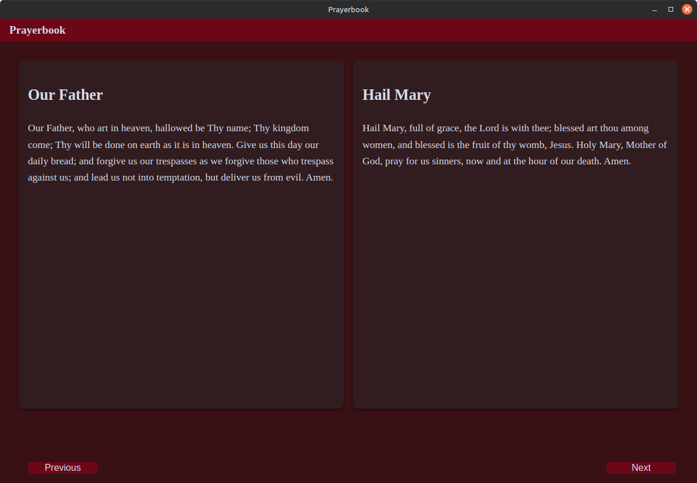

# Prayerbook App

A simple, clean, and modern desktop application for daily prayer and spiritual reflection.

## About The Project

The Prayerbook App was built to provide a distraction-free way to access a curated collection of 24 written prayers. It is designed with simplicity and reverence in mind—like a digital prayer book.

This app uses the same technology stack as the Journal and Bible apps and is packaged as a lightweight, cross-platform desktop application using Electron.

## Features

* **24 Curated Prayers:** A thoughtfully selected collection of prayers, organized in a simple book-style layout.
* **Book Format UI:** Navigate the prayers like a physical book for an intuitive and peaceful experience.
* **Offline Access:** All prayers are stored locally in a lightweight SQLite database—no internet required.
* **Fast and Lightweight:** Minimal UI, fast loading, and completely self-contained.

## Built With

* [Electron.js](https://www.electronjs.org/)
* [Node.js](https://nodejs.org/)
* [SQLite3](https://www.sqlite.org/index.html)

## Download

[Download Latest Release](https://github.com/Bighairymtnman/Prayerbook/releases/latest)

## Screenshots

## License

© 2025 Andrew Nicastro. All rights reserved.

This application is provided as-is for personal use. Redistribution, repackaging, or commercial use is strictly prohibited without explicit written permission from the author.

